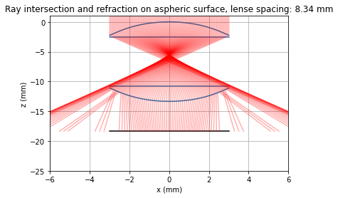

# RayTracer
This Python-based simulation models ray propagation through a system of aspheric lenses and flat surfaces, including refraction and total internal reflection. The core functionality includes ray-surface intersection, Snell's law-based refraction, and visualization of ray paths through a configurable optical setup. The system supports complex lens configurations, such as flipped aspheres and inter-element spacing, and plots the behavior of light across multiple rays using realistic lens parameters (e.g., Thorlabs c660TME-C).

  

